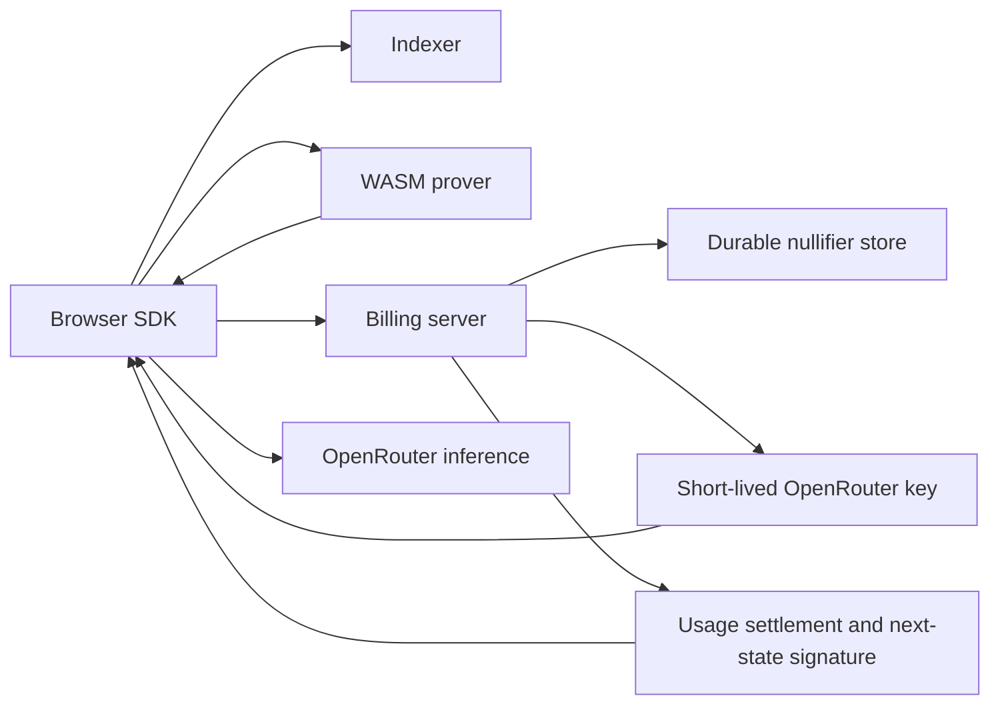

The protocol code is tracked directly under `protocol/`. The root workspace
owns runtime services; the browser SDK owns user wallet state and proving.

```text
sdk/                       Browser wallet, worker, transport, and public assets
protocol/rust/crates/
  zkapi-types              Canonical fields and v2 wire statements
  zkapi-core               BN254 Poseidon and Merkle/note helpers
  zkapi-proof              Groth16 circuits, commitments, and Schnorr signing
  zkapi-browser            WASM wallet core
  zkapi-client             Native wallet library and request journal
protocol/contracts/        Native ETH vault and Groth16 verifier
protocol/setup/v2/         Matching development setup keys
crates/
  zkapi-serverd            Proof verification, leases, transcripts, challenger
  zkapi-indexerd           Contract-event indexer and Merkle-path API
  zkapi-cli                Operator commands
```

## Request path



The browser retains the note secret, balance opening, anchor, and state
signature. Proofs establish note membership and solvency without revealing
those values to the server. A durable reservation prevents competing spends;
recovery returns the finalized transition after an interrupted request.

## Chain path

A deposit attaches native ETH to the vault's payable `deposit` call. The
contract inserts the full note leaf and emits an event. The indexer mirrors
that event and serves a depth-32 path for later proofs.

A mutual close proves the final balance and server clearance. An escape
withdrawal removes the active leaf immediately and starts a challenge period.
`zkapi-challenged` submits an archived request proof if its nullifier matches
a stale withdrawal. Uncontested escapes settle after their deadline.
